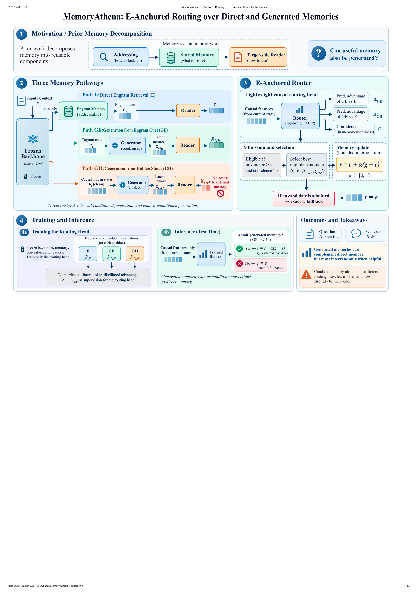

# MemoryAthena

MemoryAthena studies adaptive, multi-path Engram memory: a frozen or jointly
trained external memory is read through three complementary pathways—E, GE,
and GH—and an E-anchored router decides when generated memory should be
admitted and interpolated.

The repository contains the model components, training/evaluation entry
points, tests, and paper-facing evidence notes. The organization of the
artifact documentation is inspired by the reproducibility-oriented structure
of [XMemTransfer](https://github.com/OLAResearch/XMemTransfer), but the code
and experiments here are independent.

## What is in the repository

| Area | Location |
| --- | --- |
| Memory, readers, routing, and HF utilities | [`engram/`](engram/) |
| Training, evaluation, and analysis entry points | [`scripts/`](scripts/) |
| Small tracked configs and probe data | [`configs/`](configs/), [`data/`](data/) |
| Smoke tests and unit tests | [`tests/`](tests/) |
| Reproduction wrappers | [`run/`](run/) |
| Paper-to-artifact ledger | [`ARTIFACTS.md`](ARTIFACTS.md) |
| Offline experiment dashboard | [`web/index.html`](web/index.html) |

The source paper is maintained locally as `paper/ICLR_submit.tex`. The paper
tree and large experiment outputs are intentionally excluded from the public
source checkout; `ARTIFACTS.md` records their run-family names and verification
status without embedding private workstation or scratch paths.

## Method at a glance

1. Learn or import an Engram-style source memory.
2. Adapt generated-memory readers while keeping the configured backbone and
   memory fixed for the adaptation stage.
3. Train a compact E-relative advantage router from causal-text counterfactual
   supervision, not downstream task labels.
4. Freeze the system for downstream evaluation. Labels are used for final
   scoring and explicitly marked post-hoc analyses only.

The main Mistral configuration injects memory at layers 2 and 10 with a
four-branch reader. The appendix reports the exact training budgets, routing
thresholds, architecture, and checkpoint-selection rules.

## Framework

The framework has three complementary memory pathways: direct Engram retrieval
(E), generation conditioned on Engram cues (GE), and generation conditioned on
clean backbone hidden states (GH). A lightweight causal router predicts the
relative advantage of the generated paths over E, admits a candidate only when
it is useful and confident, and otherwise falls back exactly to E.

[](figures/overview.pdf)

[Open the full framework figure as a PDF](figures/overview.pdf)

## Main results

The headline tables below reproduce the local paper-facing aggregates recorded
by the experiment audit. The current evidence is single-seed (`seed=42`); no
cross-seed error bars are claimed here.

### Five-task open-domain QA

Open-domain QA cells are `EM/F1` (%). TruthfulQA cells are
`MC1/MC2/MC3/mean` (%).

| Setting | NQ | WebQA | TriviaQA | TruthfulQA | HotpotQA |
| --- | ---: | ---: | ---: | ---: | ---: |
| Engram-only | 20.28/28.18 | 14.86/33.28 | 63.92/69.18 | 27.42/44.32/22.69/31.47 | 17.95/25.92 |
| E-only path | 20.20/28.28 | 14.96/33.35 | 64.05/69.34 | 26.93/44.18/22.64/31.25 | 18.19/26.04 |
| Three-source E-anchored router | **22.72/33.02** | **17.86/34.60** | 62.78/70.68 | **28.15/44.04/23.02/31.74** | 15.62/26.34 |
| Mistral → Llama transfer | 20.37/29.98 | 18.06/36.40 | 60.35/67.39 | 27.78/41.57/21.87/30.41 | 16.00/25.17 |

The standalone Engram-only row and the joint-checkpoint rows do not share every
training detail, so this is an interface comparison rather than a
compute-matched causal estimate. The router is strongest on NQ, WebQA, and
TruthfulQA in this table; TriviaQA and HotpotQA remain useful diagnostics rather
than universal wins.

### Six-task general NLP

All values are accuracy (%). E/router rows use the next-token synonym-sum dCPMI
protocol; the historical Vanilla row uses a different full-choice scorer and
is shown for traceability only.

| Method | SST2 | MR | CR | RT | AGN | Yahoo | Average |
| --- | ---: | ---: | ---: | ---: | ---: | ---: | ---: |
| Vanilla Mistral † (historical scorer) | 81.08 | 75.60 | 74.00 | 74.67 | 73.24 | 55.03 | 72.27 |
| Engram-only | 84.17 | 81.00 | 82.40 | 82.36 | 72.93 | 57.51 | 76.73 |
| Three-source router ‡ (Yahoo τ=1.0) | **88.07** | **84.70** | **84.10** | **83.86** | **76.64** | 57.43 | **79.14** |
| Router reference (all τ=0) | 88.07 | 84.70 | 84.10 | 83.86 | 76.64 | 45.91 | 77.22 |

† Historical Vanilla and E/router scores are not a matched headline baseline.
‡ The displayed 79.14 average uses the same router checkpoint with Yahoo
threshold `τ=1.0` selected by a post-hoc test-set sweep; the other five tasks
use `τ=0`. The all-`τ=0` row is retained to make the threshold sensitivity
visible. Labels are used for final accuracy, not for memory, reader, or router
training.

For the full audit, protocol notes, ablations, transfer results, HaluEval, and
the incomplete scaling evidence, see [`ARTIFACTS.md`](ARTIFACTS.md).

## Scaling configuration

Scaling is joint model-side scaling, not only “make the memory table larger”:
the backbone, Engram table, generated-memory modules, readers, and router are
scaled together. The memory-side count excludes the backbone.

| Scale | Backbone | Engram | Generator | Readers | Router | Memory-side total |
| --- | ---: | ---: | --- | ---: | ---: | ---: |
| Small | 124M | 33.554M | 256 / 2 / 4 | 16 | 64 | 37.573M |
| Medium | 345M | 93.716M | 428 / 2 / 6 | 24 | 104 | 104.008M |
| Large | 774M | 209.715M | 640 / 3 / 8 | 40 | 160 | 238.212M |
| XL | 1.5B | 405.537M | 896 / 4 / 12 | 56 | 224 | 472.912M |

The current scaling evidence is deliberately reported as a partial artifact
set until every memory, expert, and final router point has the same verified
corpus, budget, checkpoint, and completion metadata. See the scaling section in
[`ARTIFACTS.md`](ARTIFACTS.md).

## Reproduce locally

The project uses Python 3.11+ and `uv` for dependency management.

```bash
uv sync
uv run python -m py_compile engram/*.py scripts/*.py
uv run pytest -q
```

For a small end-to-end smoke run, inspect the wrappers under [`run/`](run/)
before launching them. Large training and evaluation runs are designed for
the CSC cluster and should be submitted only after local syntax/tests and the
resource-minimization audit pass.

Useful entry points include:

```text
scripts/eval_openqa.py
scripts/eval_general_paper_aligned.py
scripts/eval_general_nlp_halueval.py
scripts/eval_scaling_backbone.py
scripts/eval_case_study.py
scripts/eval_code_functional.py
scripts/benchmark_compute_cost_eonly.py
```

The compute-cost benchmark measures E-only versus MemoryAthena inference
latency, tokens/s, peak CUDA memory, Slurm elapsed time, and actual GCD-hours.
It is an inference-only measurement; values should be quoted only after the
corresponding Slurm result and completion marker exist.

## Evidence and limitations

Read [`ARTIFACTS.md`](ARTIFACTS.md) before using a number in a paper. The
current audit records several important boundaries:

- the historical Vanilla NLP row used a different scorer from the E/router
  rows and is not a matched headline baseline;
- the Yahoo high-threshold result is a post-hoc test-set threshold sweep and
  must be labeled as such;
- the transfer results lack a matched bare target-Llama baseline;
- HaluEval uses a separate choice-log-probability protocol;
- coding functional accuracy and the complete routed downstream comparison are
  not interchangeable with lexical PPL/F1 diagnostics;
- scaling and compute-cost claims remain conditional on the completion and
  validation status recorded in the ledger.

No training token, private cluster path, or credential belongs in a public
README. Raw logs, checkpoints, and job manifests remain outside the source
checkout.

## GitHub stars

[](https://github.com/MJLee00/ATHENA)

## License

Apache 2.0. See [`LICENSE`](LICENSE).
